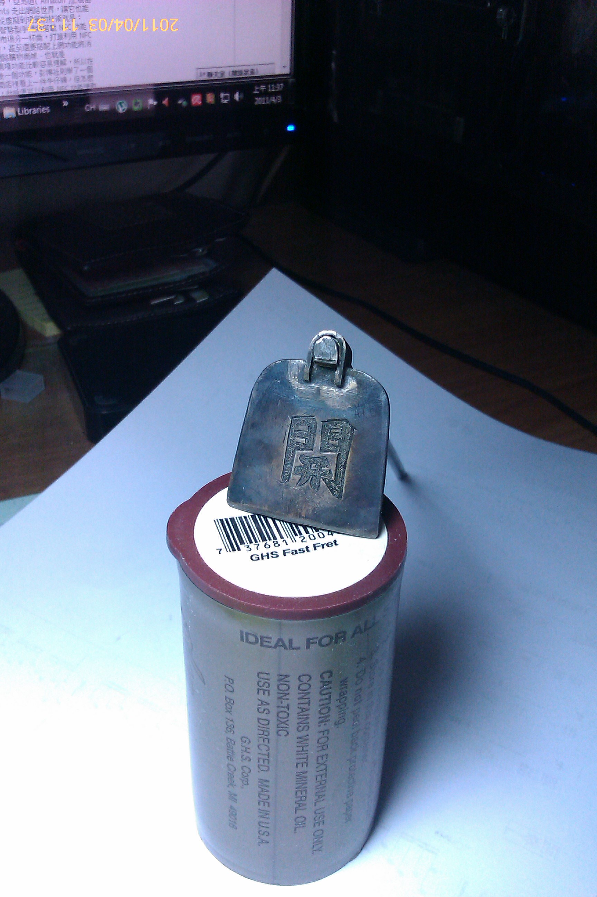
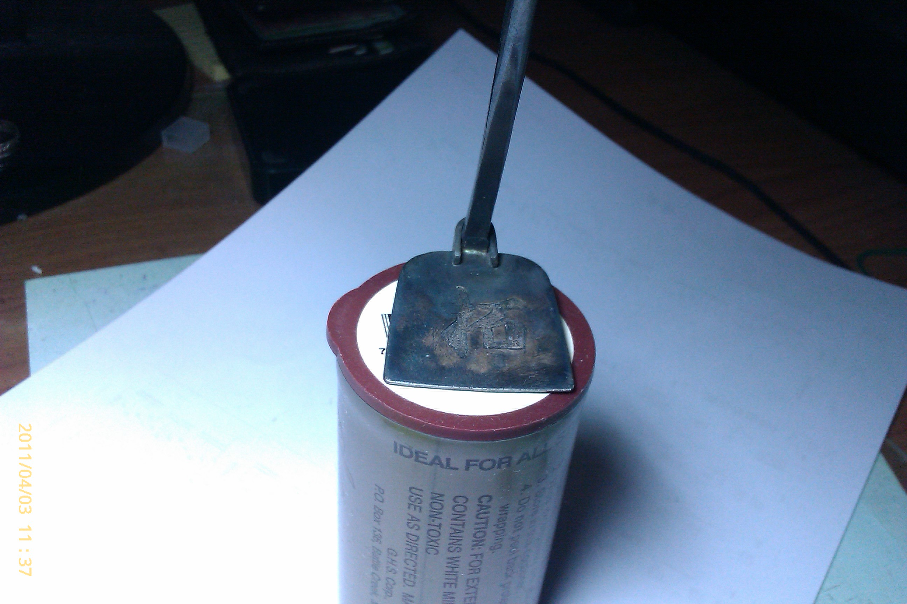

# Developer, or Engineer

> 我習慣稱自己為 Software Developer，而不是 Software Engineer。
這篇文章：Developer vs. Engineer 也講到兩個差異，不過跟我看法完全相反。

他說 Developer is:

A developer executes. Their tal

* * *

我習慣稱自己為 `Software Developer`，而不是 `Software Engineer`。

這篇文章：[Developer vs. Engineer](https://jason.pureconcepts.net/2012/08/developer-vs-engineer/) 也講到兩個差異，不過跟我看法完全相反。

他說 Developer is:

> A developer executes. Their talents often focused to a single area. Without need for the “big picture”.

Engineer is:

> An engineer designs and plans. Always aware of the “big picture”.

其實我不認同他的說法，以下是我自己的定義。

Developer (開發者) 是 `開拓者`:

> 先驅 (pioneer)，概念的發想、與實踐，就像是定義 TCP、Algorithm、SRE、Cloud Computing、Agile 這些觀念的發想起先者。他不只知道 “big picture”，他還知道趨勢與未來。

Engineer (工程師) 則是 `實踐者`:

> 當代的執行者，把一些想法，有計畫的執行與落實。他專注的是眼前、此時時刻的目標，所以也知道 “big picture”，但不見得有遠見。

對我來說 [愛因斯坦](https://zh.wikipedia.org/wiki/%E9%98%BF%E5%B0%94%E4%BC%AF%E7%89%B9%C2%B7%E7%88%B1%E5%9B%A0%E6%96%AF%E5%9D%A6) 是物理界的 `開拓者 (Developer)`，他提出很多概念、想法、推論、理論，像是相對論。而那些把它實踐出來的，用相對論做出原子彈，實踐出來的人是 Engineer。

`工程師 (Engineer)` 在我心裡是非常崇高，而且受人尊敬的，是個實踐家、執行者。他們必須面對眼前的資源、現況、局勢、關係，做出決定、選擇，他們必須非常嚴謹、務實、依照某一些理論、想法，做事情。

所有企業裡都要有開拓者，通常這個人就是想出 Business Model 的老闆 (CEO)，也要有實踐者，通常是技術很厲害的技術長 (CTO)。

開拓
--------------

我的老爸是個冶金師，台灣話俗稱『打金的』，他會製作各式各樣的戒指、手環、項鍊等。。。

後面兩張照片是我工作後，老爸蒐集了一堆破銅爛鐵後，利用所剩不多的冶金工具，把裡面的『銀』萃取出來後做出來的『鋤頭』。萃取純銀要花很多時間，把破銅爛鐵融化，然後利用工具和化學材料，把銀從合金裡面萃取出來，然後從新鑄模、雕刻。工作環境是高溫、高熱、需要體力以及耐力的。

上了年紀的老爸已經不像年輕那樣有體力，冶金工具也不是那麼齊全了，但是老爸還是把鋤頭細節做得惟妙惟肖。

『鋤頭』象徵著農家子弟的踏實、樸實、執著的精神。純銀的鋤頭有兩把，一把給我哥，一把給我。

我的鋤頭上刻了兩個字『開拓』，勉勵我秉持農家子弟精神，在事業上持續『開拓』。

我的路還很遠，要持續『開拓』，落實 Developer 的精神。

PS: 因為是純銀鑄造，沒有特別封裝，很容易就氧化，所以照片中看起來黑黑的。

* * *

*   [Senior Software Developer](資深軟體工程師.md)
*   [聊聊人力招募 (Hiring)](聊聊人力招募.md)
*   [人力招募 - 準備篇：確認需求、條件、定位、市場狀況](人力招募-零、準備篇：確認需求、條件、定位、市場狀況.md)

*   [Developer vs. Engineer](https://jason.pureconcepts.net/2012/08/developer-vs-engineer/)

* * *

* * *

[Source](https://rickhw.github.io/2017/07/01/Management/Developer-or-Engineer/)