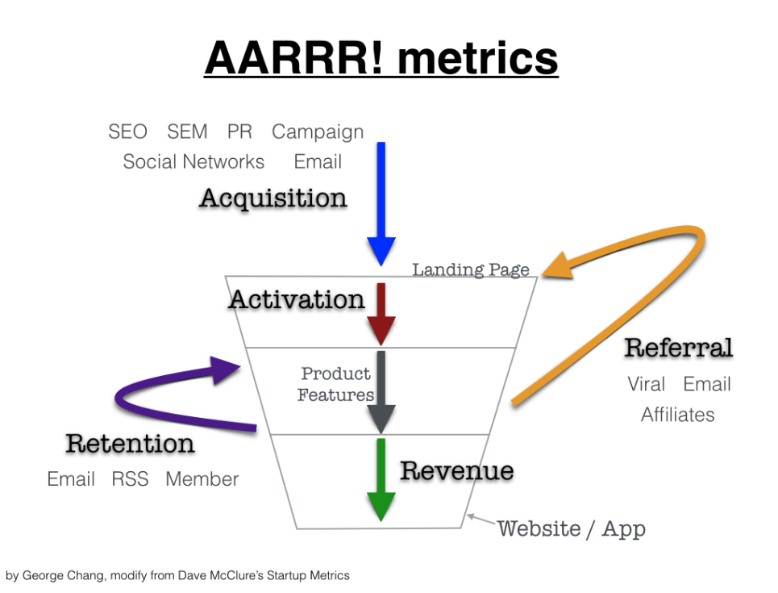

# 人力招募 - 一、萬事起頭難：面試名單從哪來？

> 接續 前一篇：準備篇 的介紹，繼續整理招聘的心得：萬事起頭難，名單從哪來？
一般人找工作要不是主動投履歷，要不就被動等待通知面試。從招募角度也是，用人單位的面試名單不會從天上掉下來，這些名單要不是主動找來源，要不就被動等待。不管主動、被動，都要面對以下的幾個問題：

面試名單從哪來？
如何過濾、篩選

* * *

接續 [前一篇：準備篇](人力招募-零、準備篇：確認需求、條件、定位、市場狀況.md) 的介紹，繼續整理招聘的心得：`萬事起頭難，名單從哪來？`

一般人找工作要不是主動投履歷，要不就被動等待通知面試。從招募角度也是，用人單位的面試名單不會從天上掉下來，這些名單要不是主動找來源，要不就被動等待。不管主動、被動，都要面對以下的幾個問題：

*   面試名單從哪來？
*   如何過濾、篩選名單？
*   為什麼面試意願不高？

問題一：面試名單哪裡來？
--------------------------------------------

確認招聘的人力需求後，第一個要面對的問題是：`面試要有名單，但是這些面試名單從哪來？`

在 [前一篇](人力招募-零、準備篇：確認需求、條件、定位、市場狀況.md) 確認了招募的方向，下一步就是要先有可以面試的清單，才有辦法面試，也才有機會謀和。一般招募來源、管道不外乎以下幾大類：

*   `人力資源網站`，台灣大概有：
    *   老牌子：104、1111
    *   新興、新創：Linkedin、Cakeresume、mit.jobs、yourator、facebook …
*   `Headhunter`：俗稱獵人頭、hunter，通常是針對中高階專業人才、中高階經理人進行媒合
    *   每家 Hunter 的遊戲規則不一樣，例如佣金比例、合約保固 or 有效期限，不適用的後續 … 等，業主要跟 Hunter 確認清楚遊戲規則。
    *   Hunter 提供的 CV 大多都是包裝過的，所以篩選要更謹慎，心裡要有一把尺。
    *   Hunter 對於職務理解的程度，決定磨合的機率。特別像是一些新興的名詞：DevOps, SRE, Data/AI/ML … 等很新穎的工作職務。
*   `親友介紹`：透過親友介紹，是近水樓台的方法。
*   `校園招募`：
    *   招募剛畢業有潛力的年輕人，同時也會企業打造形象
    *   透過產學合作，讓企業快速可以快速磨合。
    *   更甚者，直接創立學校，直接從需求著手，培養企業需要的人才，企業也就有源源不斷的人力來源，減少用人時人力資源的問題。台灣最有名的例子就是台塑集團的明志工專，[中國阿里集團的湖畔大學](https://www.bnext.com.tw/article/35164/BN-ARTICLE-35164)
*   `社群招募`：這幾年，各式各樣的社群活躍，公開的、私有的、免費的、付費的，都是不錯的管道
    *   `活動`：社群也會結合研討會與企業合作，開立招募攤位，做徵才招募。
    *   社群資金來源通常來自於募資、或者企業支持，但是太多企業支持，整個色彩會變，所以要自行判斷
*   `教訓訓練機構`：一些訓練機構會定期舉辦成果展，然後跟企業合作，這是個不錯的開始。

> `隱藏資訊`：這些來源，其實背後也隱含著人力素質的差異。會包裝自己的人、會選擇平台的，素質相對比較高，當然期待也會是一樣。但是會包裝自己的人，也可能隱藏了某些缺點與不足，甚至是過度膨脹。這些都是無法從 CV 上看出來的，也是面試過程要探索出來的。

知道有這些來源之後，用人單位可以：`主動撈`、`被動等待`。

被動就是放在那邊等人來投，或者請其他人 (e.g., HR) 幫忙撈。如果可以跟 HR 充分溝通，讓他們知道需要的條件，會節省很多時間。被動守株待兔就是靠運氣，所以有多少人來面很難控制。除非 JD 寫得很有吸引力，像是薪資範圍很高、公司名聲很好，錢多事少離家近之類的。

主動指的是用人主管自己去撈，透過人力銀行、親友關係詢問 … 等。名單不會從天空掉下來，所以主動出擊很重要，而且更能掌握狀況。

獲取名單的過程，就如同 [AARRR](https://www.inside.com.tw/article/5015-secrete-of-growth-hacker) 的第一個 A: `Acquisition（獲得新使用者）`，如下圖：

[

問題二：如何過濾、篩選名單？
--------------------------------------------------

面試的目的是為了找到適合的人，要面對的問題有以下：

*   什麼是適合的人？條件是什麼？
*   如何過濾、篩選名單，以提高謀合率？

在篩選時，以下常用的篩選、過濾方式：

*   `關鍵字`：用來篩選的字、詞
    *   角色：backend, SRE, 維運, MIS, DevOps, Developer, Frontend
    *   技能：node.js, java, AWS, golang
    *   企業：想挖某些企業的優秀人才，直接用企業名稱當關鍵字搜尋，這也是很常用的方法。
    *   Buzzwords: DevOps, SRE, Agile, Scrum …
*   `求職積極度`：最近更新履歷的時間、待業中
*   `量化貢獻`：履歷中有沒有實際的貢獻，像是完成 10k concurrence 的網站。
*   `個人目標`：主要是想要什麼？想做架構師？設計？開發？資料庫？
    *   個人目標如果具體且清楚，篩選會比較快。至少是有想法的。

問題三：沒有面試意願怎麼辦？
--------------------------------------------------

透過管道，透過關鍵字篩選，終於有了理想的清單，表面上的條件都符合需求，也正在找工作中，但就是不想來面試，怎麼辦？有以下幾點要思考：

*   回過頭去看看 JD 的寫法是需要調整？
    *   描述是否要貼近招募的族群？讓他們沒有距離感。
*   薪資在市場的行情比例
*   企業的福利、過往的活動照片
*   企業在外面面試的評價

凡走過必留下痕跡，企業形象在這時候就顯得格外的重要。某某企業，因為食安事件，不只影響商譽，同時連帶影響的也包含招募。

結論
--------------

撈單這個過程很像是業務在拓展市場一樣，要先有名單才有機會創造業績，所以很多業務人員必須花時間在社交 (Social)，目的就是製造連結機會的面積，這是必要的，而且這些管道是需要經營關係的，像是定期聯繫、三節送禮是有其必要性的。同樣的，企業為長久的生存，招募也必須有著必要的連結，未來有人力需求，徵才時才不會沒有管道。

萬事起頭難，起頭才能成萬事。

> 雖然我滿常跑社群的，但是熟識我的人應該不難察覺，我不太會在社群活動談這些，畢竟公私有別，所以有興趣私下都可以問我，但原則上，我不會在社群提招募的事。

找到人了，約好時間地點面試了，下一篇繼續談的是：[見面談：招募第一關 面試](人力招募-二、見面談：招募第一關-面試.md)

* * *

系列文章
--------------------

*   [聊聊人力招募](聊聊人力招募.md)
*   [零、準備篇：確認需求、條件、定位、市場狀況](人力招募-零、準備篇：確認需求、條件、定位、市場狀況.md)
*   [一、萬事起頭難：面試名單從哪來？](人力招募-一、萬事起頭難：面試名單從哪來？.md)：撈單、詢問意願、電訪
*   [二、見面談：招募第一關-面試](人力招募-二、見面談：招募第一關-面試.md)：面試流程、評核
*   [三、深度對話：價值觀](人力招募-三、深度對話：價值觀.md)：為什麼二面？
*   [四、客觀談論：薪資](人力招募-四、客觀談論：薪資.md)：談薪資的考量點
*   [五、最後確認：報到時程](人力招募-五、最後確認：報到時程.md)
*   [六、到職後：訓練、目標、評核](人力招募-六、到職：訓練、目標、評核.md)
*   [面試常見的問題](面試常見的問題.md)
*   [管理必經之路：遣散、解僱、辭呈](管理必經之路：資遣、解僱、辭呈.md)

參考資料
--------------------

*   [馬雲辦大學，創業3年以上才能入學](https://www.bnext.com.tw/article/35164/BN-ARTICLE-35164)
*   [未來十年含金量最高的職業 — 成長駭客的秘密](https://www.inside.com.tw/article/5015-secrete-of-growth-hacker)

* * *

* * *

[Source](https://rickhw.github.io/2018/08/30/Management/Hiring-Step1-Find-the-Candidates/)