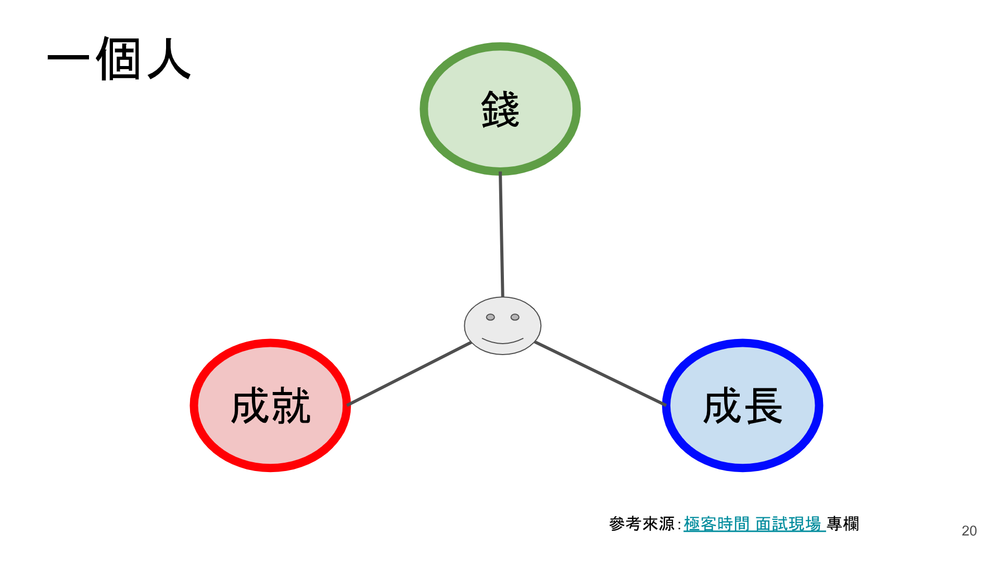
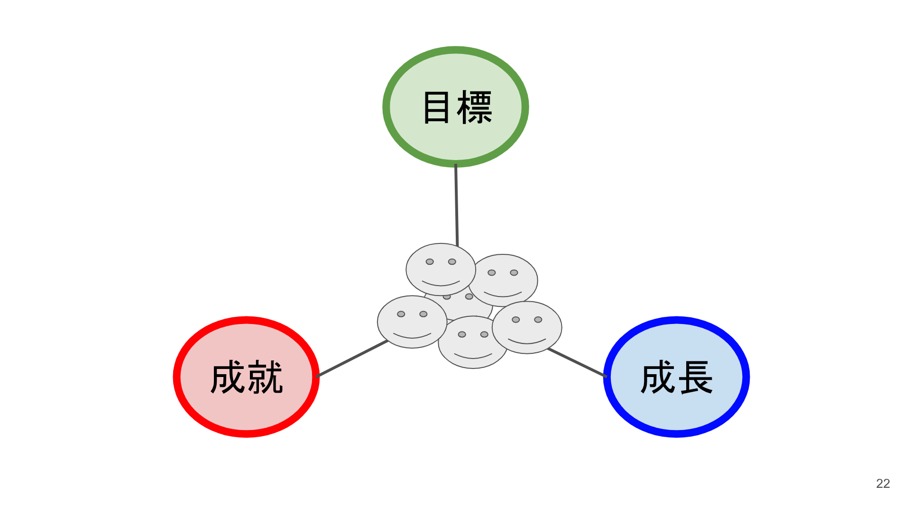
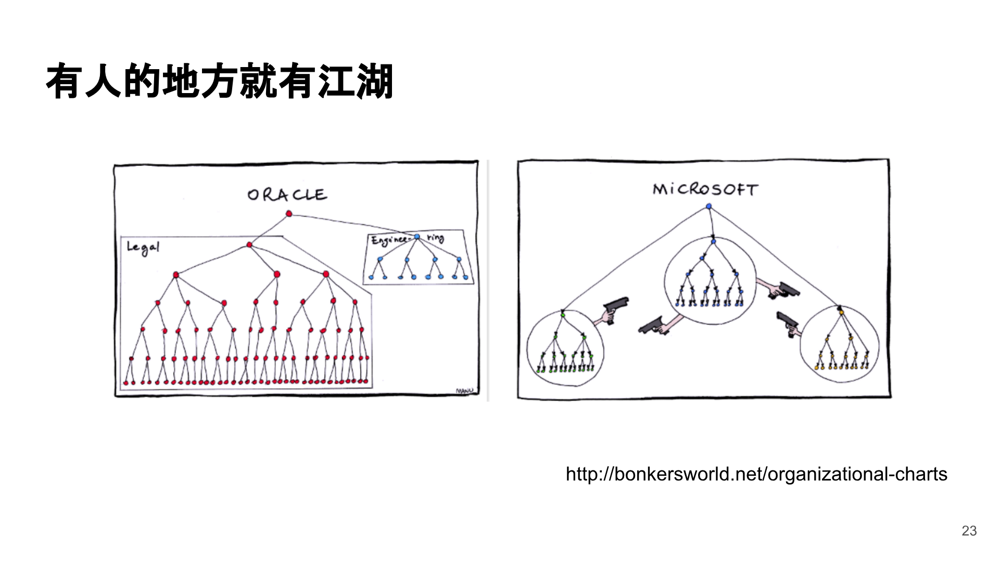
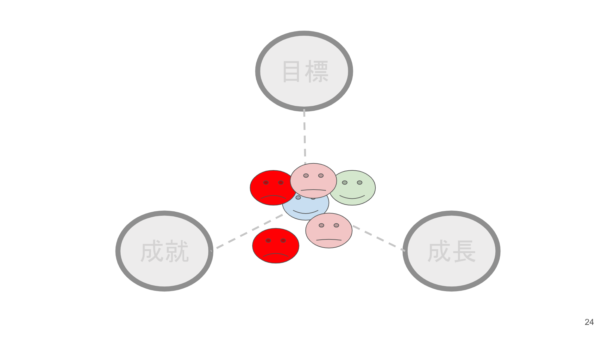
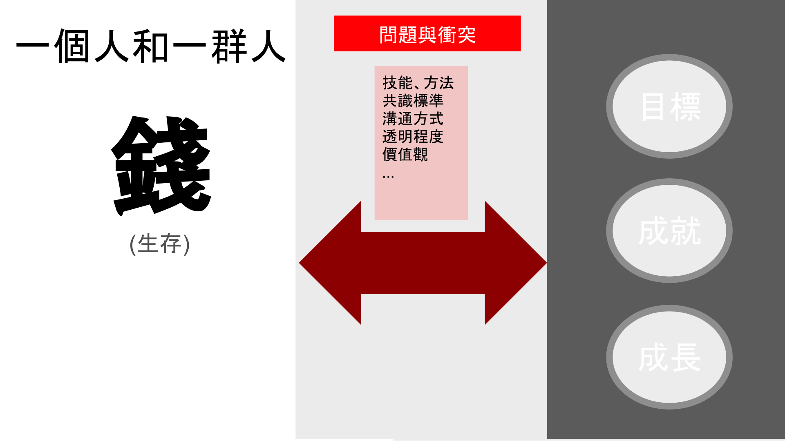
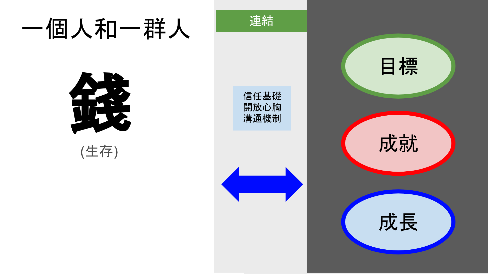

# 管理必經之路：資遣、解僱、辭呈

> 管理工作範圍廣大，人事管理 (Peopele Management) 是其中一個重要的工作範圍，本文整理身為一個管理者必須面對的課題：資遣、解僱、辭呈。

離職的形式資遣 (Layoff)因為公司經營問題，原因可能是面臨財務問題、權力之爭、併購、合併 … 等因素，必須進行人力縮減而進行的程序。通

* * *

管理工作範圍廣大，人事管理 (Peopele Management) 是其中一個重要的工作範圍，本文整理身為一個管理者必須面對的課題：`資遣、解僱、辭呈`。

* * *

")資遣 (Layoff)
---------------------------------------

因為公司經營問題，原因可能是面臨財務問題、權力之爭、併購、合併 … 等因素，必須進行人力縮減而進行的程序。通常是由經營層提出，交給人事單位裁決。資遣的對象、範圍不一，有時候不含管理者，有時候也會包含管理者自身。類似案例很多，以下是最近 (2019Q2) 半年的例子：

*   2019/04: [街口收購愛評網後轉移現金資產並解僱員工，胡亦嘉嗆：不會給錢、要提告就去！](https://www.inside.com.tw/article/16036-jkos-illegal-Dismissal)
*   2018/12: [驚！17直播年末裁員70多人　技術、行銷部門都遭殃](https://www.ettoday.net/news/20181225/1340216.htm)

這樣的新聞與事件，其實每年都有，特別是在新創公司遇到的機會是非常大的。

大部分的人遇到這樣的狀況，都是被資遣方。如果你是管理者，你沒被資遣，但卻被指派要資遣員工，這時候該怎麼辦？這種事情背後的因素可能很簡單、或者很複雜，但通常原因只有一個：

> 公司沒資金了

其他因素就很多了：

1.  Burn Rate 太高，錢燒光了
2.  產品方向改變
3.  市場變小

雙方都有該盡的權利與義務。

勞方有的權利：資遣預告天數、資遣費、謀職假

資方通常需要義務告知：資遣預告天數、通報勞工局、老闆資遣勞工時，應於勞工離職10日前通報當地勞工局（處）。

")解僱 (Fired)
------------------------------------

解僱英文是 `Fired`，指的是員工能力低於用人單位的期待，經過內部一定的評核方式之後，進行的不適任資遣程序，一般有在進行 KPI 的公司，就會開始進行 `PIP (Performance Improvement Plan，績效改善計畫)`。這個動作通常會由用人單位主管提出，協同人事一起進行。

不適任有以下因素：

1.  能力不足：無法滿足專業技能的需求，或者連續犯下嚴重疏失
2.  協作問題：無法與團隊協作、溝通不良、製造衝突、影響團隊士氣
3.  其他：盜竊商業機密、散播謠言

上述兩種算是一般因素，也會有非一般因素的：

1.  操守問題：像是有奇怪的癖好影響他人、性騷擾、歧視、偷竊 … 等
2.  個人因素：嚴重的出缺勤問題

以管理者角度，要解僱人，必須有很明確的事證，證明對象不適任，而且必須清楚地告知為何不適任，以及解雇的理由。這是不容易的事情，平常進行任務過程中，如果已經察覺到異樣，必須有方法、溝通技巧，可以告訴或者引導這樣的成員，不適任以及管理者對他的看法。對於管理者而言，這點是需要磨練，以及思考如何進行的。

沒有人聘僱一個人後，會想要解僱他／她的。如果讀過我寫的 [聊聊人力招募](聊聊人力招募.md) 系列文章，就會知道用人過程的辛苦以及糾結。辛苦招募進來的人，卻要面臨解僱，心情是很複雜的。

對於用人主管而言，如何 `好聚好散` 是個學問，讓解僱者能夠知道他的問題，以及這個過程中，能管理自身夠改善的，是用人主管可以做的。過程讓雙方都知道彼此的問題，進與退都取得共識與平衡，管理者幫被解僱者，被解僱者，也回櫃給管理者。

解雇的對象有幾種：

*   新到：到職不到半年以內
*   資深：到職兩年以上
*   重要的核心成員

不同的對象，使用的方法與技巧有很大差異。

新到職如果發現不適任，建議速戰速決。要注意的是，明確的告知不適任的原因，通常是能力不足、或者對環境的適應性，單刀直入講清楚比較好。讓對方知道，雖然無法繼續合作，但也嘗試協助他知道不適任的因素。對管理者自身而言則要反思，為什麼會有這樣的誤判？面談過程疏失了什麼？相信學歷？經歷？用人的需求不清楚？

如果要資遣資深員工，要做的準備工作就更多了。

1.  瞭解他的狀況，與上級討論狀況。通常狀況可能有以下：

*   技能停滯，無法滿足任務需求
*   連續犯下嚴重疏失
*   協作問題
*   個人因素

1.  給予機會調整工作內容，調整過程，要打點好與他協作的團隊，包含新團隊、舊團隊。
2.  最後真的還是不行，依照程序就是 PIP 了。

*   很多公司 PIP 通常已經是確定要解僱了，但實際上 PIP 是要透過 HR 的協助，找出可能改進的方法，從而把人重新放在適當的位置。

1.  找人接手他的工作：這通常會是主管決定是否要解僱的主要因素。

*   資深通常代表有一定年資，經歷過很多事情、知道最多淺規則、執行面的細節、潛在的問題、Workaround … 往往知道的甚至比技術管理者還多。

### 管理者的反思

對於管理者而言，每一次的解僱，都要反思以下：

*   如果是剛到部：為什麼會用錯人？面試過程是否有誤判？需求不清楚？
*   如果是資深成員：平常是否對他的關注不夠？他是否是因為跟不上潮流？倦勤？家庭因素？個人因素？
*   如果是核心成員：該爭取的是否沒幫他爭取？他有舞台？有幫忙他排除障礙？他遇到哪些困境自己沒協助的？

每一次的解僱，都是一次教訓與學習，如何讓人員的流動率更低？如何用對人？如何讓人才適才適所？

")自願離職 (Quitting)
---------------------------------------------------

自願離職由員工提起，英文是 `Quitting`、`Resigning`，中文相關詞彙是 辭職、離職、辭呈，是員工自行提出的。依台灣勞基法規定，依照資歷深淺，提出辭呈的員工，必須相對應的預告時程，讓雇主可以反應。

員工想離開的原因很多，整理常見的因素如下：

1.  主管的問題
2.  薪水沒有競爭力、心委屈了
3.  有更好的機會
4.  與團隊不合
5.  公司有問題：方向、組織、產品、政治問題 … etc
6.  工作內容沒有重心、沒有舞台
7.  家裡因素、健康因素
8.  個人的生涯規劃

自願離職依資歷，也分以下：

*   如果是剛到部：為什麼會用錯人？面試過程是否有誤判？需求不清楚？
*   如果是資深成員：平常是否對他的關注不夠？了解不夠
*   如果是核心成員：該爭取的是否沒幫他爭取？他有舞台？他遇到哪些困境自己沒協助的？是否被挖角？
*   如果是管理者：可能是被挖角，還是個人因素？

### 管理者的反思

管理者隨時都必須面對成員遞辭呈的心理準備，或者對於成員是否有異動有所察覺。

從職責上來說，管理者存在的目的是要讓整體組織能夠順利運作，達成任務。如果組織是一台機器，那麼掌握機器每個零件的運作狀態，就很重要。但組織不像機器，而是由人組成，所以了解每個人的狀況是必要的。

狀況，不僅止於工作上的專業技能表現，與其他成員的相處、平日的狀況也要有所掌握，但這些就需要有很多軟技能。像是：

*   合作問題
    *   跟團隊成員之間的相處狀況
    *   跨部門的溝通狀況
    *   有沒有遇到技能上的瓶頸？
    *   團隊合作的阻礙
*   主管與管理階層
    *   了解成員對於主管的看法
    *   成員對自己的期待與對公司的期待
    *   薪資期待
*   私人
    *   成員的興趣與愛好
    *   最近的學習
    *   生活上有沒有什麼困難？
    *   感情狀況？ (這要很謹慎)
    *   宗教、健康

透過瞭解這些東西，找到可能的問題，了解是否提供協助，或者建議。有些私人問題，通常我都不會直接問，而是透過相處過程，讓成員主動分享。如果成員不願意分享，千萬不可免強，這是職場大忌。與成員相處得進與退、分寸拿捏也是要掌握的，太近、太親密都是不恰當的。

這些都是平常可以在相處過程，進而了解的。目的就是，不要收到辭呈了，卻完全不知道他為什麼要離開，因為遞出辭呈背後通常也是深思的。

* * *

組織的反脆弱
--------------------------

軟體工程裡有 SRE、Chaos Engineering，目的是針對系統的 `反脆弱 (Antifragile)`、可靠性、彈性，對象是軟體系統可靠度，或者 `強韌性 Resilience` 的工程實踐。最基本的實踐就是透過增加 `冗餘 (Redundant)` 數目，把機器的數量從單一台，變成兩台以上，達成 `高可用 (High Availability, HA)` 的方法，甚至是 `故障移轉 (Failover)`。 這是系統常見的概念，那組織裡的人呢？道理類似，管理者必須隨時假設以下：

*   HA: 如果有成員離開了，誰可以接手該成員現在的工作？
*   Failover: 呈上，如果是短期離開，有人可以暫時接手？
*   Redundant: 一樣技能，有多少人會？

世界最大對衝基金的創辦人 Ray Dalio，在他的暢銷著作 [原則：生活和工作](https://www.books.com.tw/products/0010782941) 這本書提到，員工把工作做好是基本的，而且從管理的角度必須做到，任何員工都必須是可以隨時置換的。換言之，每個崗位上的角色，都必須是高可用。Ray Dalio 連自己的財務長 (CFO) 都有三位，以便可以隨時取代。

當然說法上，不需要像 Ray Dalio 那樣的說，因為顯然讓人感覺到無情，但實際上的效果確實是需要如此的。

獨特性
-----------------

以前在玩音樂時，最喜歡玩 [合成器](https://rickmidi.blogspot.com/2008/07/yamaha-motif-xs8.html) ，這種琴通常都會有數百到上千種音色。音色分成 `樂器擬真`、`合成音色` 兩大類。樂器擬真很容易理解，就是模擬真實的樂器為主要目的；合成音色完全相反，完全是天馬行空的聲音。原理是透過 `波形產生器 (Wave Generator)` + `振盪器 (OSC)` + `濾波器 (Filter)` + `效果器 (FX)` 串接組成，有無限的排列組合。合成器通常背後有音色設計師 (Tone Designer) 的角色，負責設計音色。

我很喜歡玩這些合成音色，但有時候也常在思考，為啥這些設計師會設計出這些 `奇怪` 的音色？這些奇怪的音色要怎麼命名？這些音色應該用在什麼樣的音樂？怎樣的曲風？編曲時，怎麼會想到這個音色？但是我相信每一個音色的獨特性，也相信都可以找到他的價值，人也是。

我相信人只要放對位置，透過適度的引導就可以發光發熱。所以是不是人才，由他的位置決定。而主管、管理者的任務，就是找到這個人適合的位置，把他放進去，引導他發光發熱，然後讓他去影響更多人。

工作是為了什麼？
--------------------------------

底下截圖是我在一場 [分享](https://rickhw.github.io/2019/04/27/DevOps/Introduce-to-Continuous-Delivery-2/) 中整理的想法，其實就是在思考：

> 除了錢之外，工作還能給什麼？

整理其中的 Slide 如下：

  
  
  
  
  
  
  

經驗
--------------

職涯數十年下來，這三個情境，不管是資遣（被資遣、資遣員工）、解僱、離職，我都經歷過，每個過程都是個歷練，但這是一個管理者必經的過程。

[聊聊人力招募](聊聊人力招募.md) 一文提到了人事管理的生命週期，簡單說的就是 `聘僱 (Recruiting)`、在職用人、`離職 (Separation)` 三個，如下圖：

這些都是人事管理 (People Management) 必經的過程。

* * *

延伸閱讀
-----------------------

*   [導讀持續交付 2.0 - 談當代軟體交付之虛實融合](https://rickhw.github.io/2019/04/27/DevOps/Introduce-to-Continuous-Delivery-2/)

招募系列文
-----------------------

*   [聊聊人力招募](聊聊人力招募.md)
*   [零、準備篇：確認需求、條件、定位、市場狀況](人力招募-零、準備篇：確認需求、條件、定位、市場狀況.md)
*   [一、萬事起頭難：面試名單從哪來？](人力招募-一、萬事起頭難：面試名單從哪來？.md)：撈單、詢問意願、電訪
*   [二、見面談：招募第一關-面試](人力招募-二、見面談：招募第一關-面試.md)：面試流程、評核
*   [三、深度對話：價值觀](人力招募-三、深度對話：價值觀.md)：為什麼二面？
*   [四、客觀談論：薪資](人力招募-四、客觀談論：薪資.md)：談薪資的考量點
*   [五、最後確認：報到時程](人力招募-五、最後確認：報到時程.md)
*   [六、到職後：訓練、目標、評核](人力招募-六、到職：訓練、目標、評核.md)
*   [面試常見的問題](面試常見的問題.md)
*   [管理必經之路：遣散、解僱、辭呈](管理必經之路：資遣、解僱、辭呈.md)

參考資料
--------------------

*   勞工局: [資遣解僱權益小百科](https://www.mol.gov.tw/23323/23324/)
*   [勞工自請辭職應在幾天前預告僱主？](https://www.mol.gov.tw/service/19851/19852/19859/14646/)
*   [原則：生活和工作](https://www.books.com.tw/products/0010782941) \- Ray Dalio

* * *

* * *

[Source](https://rickhw.github.io/2019/07/09/Management/Layoff-Fired-Resiging/)