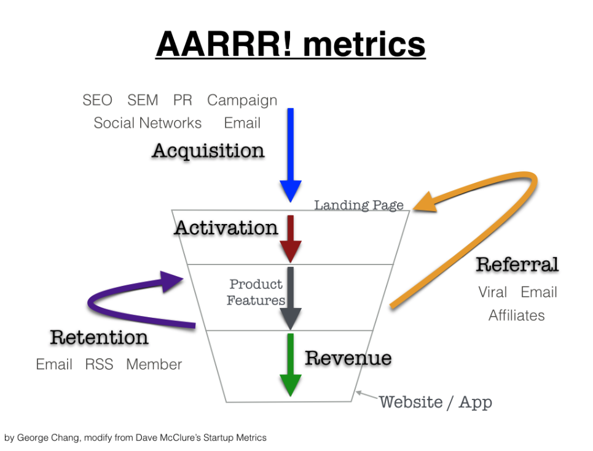
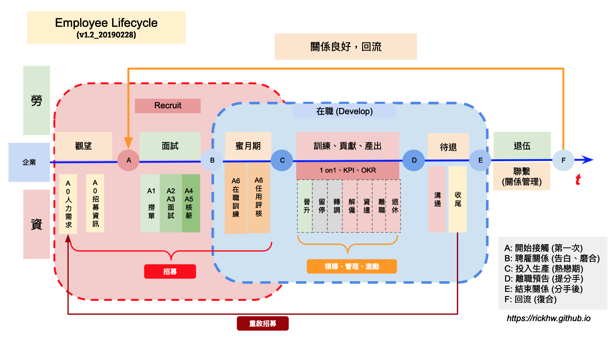

# 聊聊人力招募

> 今年 (2018) 有很多時間都放在如何作 人力招聘 (Hiring)，這系列文是整個過程中的心得、想法、遇到的問題。文章是從管理者、用人主管 角度出發，談到如何從需要資源開始、如何向上溝通、與人力資源協作、面試名單從哪裡來、如何面試、如何談薪資、報到之後如何確認符合需求 … 等。

2021&#x

* * *

今年 (2018) 有很多時間都放在如何作 `人力招聘 (Hiring)`，這系列文是整個過程中的心得、想法、遇到的問題。文章是從管理者、用人主管 角度出發，談到如何從需要資源開始、如何向上溝通、與人力資源協作、面試名單從哪裡來、如何面試、如何談薪資、報到之後如何確認符合需求 … 等。

> 2021/04/24: 本文授權 1111 人力銀行 轉載：[聊聊人力招募：你到底是在Hiring還是Recruiting？](https://www.jobforum.tw/discussTopic.asp?cat=hrfriend&id=243371)

* * *

招募是個難題，整個工作跟業務有些像，從零開始：確認目標、需求、找名單、打電話、面對人、設計流程、思考如何評斷、設計技能驗證方法、談薪資、面對市場的比較、對上溝通、跟 HR 協作、任用確認、OnBoard Training、確認符合 … 是個痛苦且漫長的路。

整理這些文章，不是要炫耀做得很有心得、或做得很好，而是這件事情不容易，挫折滿滿、充滿政治角力、人性的血淋淋，因為如此，更需要好好的沈澱，好好的討論如何把它做好，創造雙贏（Win Win）

招募工讀生是招募、招募工程師是招募、招募架構師是招募、招募業務是招募、招募 VP 是招募，不管怎樣的角色，都應該好好面對它，把他做好，這是對工作負責，敬業的表現。

這系列文章，將從管理者、用人主管的角度，整理整個招募過程需要面對的人事物，從頭到尾的心得筆記 (血淋淋)。如果想要做管理、想做主管、想建立團隊，這是個必經的過程，這些心得或許可以參考看看。

相關的角色
-----------------------

招募工作通常會有以下角色：

*   甲方
    *   應試者、Candidate、勞方
*   乙方
    *   用人主管、面試官、資方
    *   人力資源、HR
    *   用人主管的主管
*   第三方
    *   獵頭 (Head Hunter)
    *   社群
    *   競業、同業

招募系列文章
--------------------------

我把整個招募流程分成以下部分：

*   [聊聊人力招募](聊聊人力招募.md)
*   [零、準備篇：確認需求、條件、定位、市場狀況](人力招募-零、準備篇：確認需求、條件、定位、市場狀況.md)
*   [一、萬事起頭難：面試名單從哪來？](人力招募-一、萬事起頭難：面試名單從哪來？.md)：撈單、詢問意願、電訪
*   [二、見面談：招募第一關-面試](人力招募-二、見面談：招募第一關-面試.md)：面試流程、評核
*   [三、深度對話：價值觀](人力招募-三、深度對話：價值觀.md)：為什麼二面？
*   [四、客觀談論：薪資](人力招募-四、客觀談論：薪資.md)：談薪資的考量點
*   [五、最後確認：報到時程](人力招募-五、最後確認：報到時程.md)
*   [六、到職後：訓練、目標、評核](人力招募-六、到職：訓練、目標、評核.md)
*   [面試常見的問題](面試常見的問題.md)
*   [管理必經之路：遣散、解僱、辭呈](管理必經之路：資遣、解僱、辭呈.md)

這些過程，所要篩選、經歷的，很像是一個拓展市場的業務要經歷的過程，人數從多到少，逐漸篩選，是個倒三角形的形狀。這過程的概念與過程，與 [AARRR](https://www.google.com/search?biw=1152&bih=614&tbm=isch&sa=1&ei=W7UhXPztFYah8QWO3JPgCw&q=aarrr&oq=aarrr&gs_l=img.3...0.0..78918...0.0..0.0.0.......1......gws-wiz-img.9ydD-Wa14KE) 模型很像，如下圖：

*   Acquisition（獲得新使用者）
*   Activation（成為有效用戶）
*   Retention（用戶留存、回訪
*   Revenue（用戶付費）
*   Referral（用戶推薦）

")人事管理 (People Management)
------------------------------------------------------------------------------

從 2012 年開始帶團隊開始，就一直在做招募工作，一直以來都有自己一套心法與程序。招募只是管理工作之一，從整個員工在職的生命週期來看，頭到尾、起到訖，有以下：

*   用人：包含招募 (hiring)，就有解雇 (fire)、資遣 (lay-off)、離職 (quit)
*   在職期間：起訖之中的在職時間，包含以下：
    *   訓練
    *   任務管理
    *   考核
    *   升等
    *   轉任 … 等，

用時間軸來看，如下圖：

本系列文章描述的是紅色匡中的 `Recruit` 部分。

這些都是管理者必經與面對的過程，這系列招募文是管理工作的其中一塊拼圖。

Hiring or Recruiting?
----------------------------------------------------------------------

招募英文用詞有兩個：Hiring、Recruiting，中文翻譯都是招聘、招募，精準翻譯是：Hiring 是雇用、Recruiting 是招聘、招募。

兩者的差異在 [Quora.com](https://www.quora.com/What-is-the-difference-between-hiring-and-recruiting) 找到這樣的答案：

Recruiting Process:

> The recruitment phase of the hiring process takes place when the company tries to reach a pool of candidates through job postings, job referrals, advertisements, college campus recruitment, etc. Candidates who respond to these measures then come in for interviews.

Hiring Process

> Hiring, on the other hand, is the part of the recruitment process that involves making a decision on the most suited candidate and offering the position to them at a fee.

Recruiting 是還沒開始招聘程序，但是先站在市場的角度，協助目標（淺在招募對象）釐清工作職務、工作參考、建立企業形象廣告 … 等，主要是 HR 的工作。Hiring 則是已經進入職務需求確認，由用人主管確認是否符合需求的過程，簡言之，本系列文的就是了。

> 動詞：hire 可以和 employ 互用。

* * *

參考資料
--------------------

*   [面試現場](https://time.geekbang.org/column/intro/155)
*   [What is the difference between “hiring” and “recruiting”?](https://www.quora.com/What-is-the-difference-between-hiring-and-recruiting)

延伸參考
--------------------

*   [AARRR model – 新創事業不可不知的成長公式](http://georgechang.im/startup-metrics-aarrr-model/)
    *   [一次弄懂五個常見的用戶增長框架：AARRR、RARRA、Growth Loops、HEART、AIDA](https://medium.com/3pm-lab/growth-101-introduction-to-5-popular-growth-frameworks-aarrr-rarra-growthloops-heart-aida-13296ba7dcbc)

異動紀錄
--------------------

*   2021/04/27: 本文授權 1111 人力銀行 轉載：[聊聊人力招募：你到底是在Hiring還是Recruiting？](https://www.jobforum.tw/discussTopic.asp?cat=hrfriend&id=243371)
*   2019/01/06: 增加 Hiring or Recruiting 的說明。
*   2018/08/20: 初稿

* * *

* * *

[Source](https://rickhw.github.io/2018/08/20/Management/Overview-Hiring/)