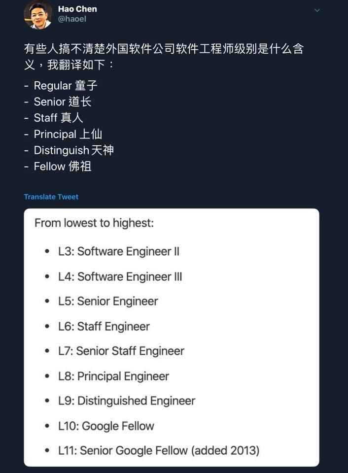

# 資深軟體工程師

> 工程師要像趙雲一樣藝高、膽大、心細。
有些公司，只要是碩士畢業，就掛 高級工程師、資深工程師。。。這種感覺就跟 幹訓班 出來，就掛 將軍 一樣軍銜，名不符實。

只要付得起每個月信用卡循環利息最低金額就可以申辦『白金卡』，這信用還真廉價 …

我覺得：

Title 代表的不是表象，而雇主對員工的是

* * *

工程師要像趙雲一樣藝高、膽大、心細。

有些公司，只要是碩士畢業，就掛 `高級工程師`、`資深工程師`。。。這種感覺就跟 `幹訓班` 出來，就掛 `將軍` 一樣軍銜，名不符實。

> 只要付得起每個月信用卡循環利息最低金額就可以申辦『白金卡』，這信用還真廉價 …

我覺得：

> Title 代表的不是表象，而雇主對員工的是信任、期待與責任

那到底怎樣的條件才可以算是 `資深軟體工程師`？還有其他的 Title？

* * *

資深
--------------

資深英文 `Senior`，字面上隱含 `經歷` 與 `時間` 的概念。

更精準的「資深」應該是 `20 年以上`，專注在同一領域的資歷才是，不管是技術的深度、廣度、Domain Knowledge 的範疇，都有一定程度的認識。這等級是跟 `Master`（大師）幾乎快ㄧ樣（但還是有差）。。。

> 中文的『前輩』，通常是指年紀相距廿年以上。

歲月累積的經驗，在執行工作時，可以透過經驗，達到必要的水準之上，並且有獨到的見解、判斷力、與方法，雖然見解或方法不見得最佳解或業界標準。

用中文來說，`資深` 算是 `匠`，像是同樣一件事情做了數十年，透過經驗法則，慢慢改善。工作上有時候會遇到不同領域的人，像是修水電師傅、馬路上鋪馬路的師傅、辦公室裝潢的裝修師傅，這些我都會尊稱他們叫 `師傅`。因為人家是有技能，可以解決專業問題。

些資深工作者隨著歲月的積累，最後自成一派，然後開山立派。一些知名、且沒有唸完大學的企業家、實幹家都算是，像是 Bill Gates、Larry Page、Steve Jobs …

> 關鍵字：有技術能力、很多的實務經驗、具備獨到見解、具備獨立判斷能力

專業
--------------

資深不一定等於專業。

`專業` 是經過有公信力的訓練，取得絕佳 `科學方法`、`工程實踐` 的技術能力，加上後天豐富的 `實務經驗`，能夠依據需求或問題背景狀況，提出適當的 `解決方案`，精準的解決問題，如此才是專業。

以資訊業來講，大學裡，資訊工程學系的學科，教授的都是 `科學方法` 與 `工程實踐` 的科目，過程會學習很多像是 計算機科學：

*   Operating Systems (作業系統)
*   Algorithm (演算法)
*   Data Structure (資料結構)
*   Compiler (編譯器)
*   Computer Architecture (計算機系統結構)
*   Computer Organization (計算機組織)
*   Computer Network (計算機網路)

等 … 理論科學，其他還有像是軟體工程的課程。

[管理者如何持續學習技術？](https://rickhw.github.io/2019/03/30/Management/How-do-Manager-Keep-Learning/) 以及 [證照有無用論？](https://rickhw.github.io/2019/08/14/About/About-Certificate/) 都提及一些理論經典、系統知識、還有工程實踐、經典方法論都算是專業 `技能 (Skills)` 的展現。但是專業不是只有技能，更多的是運用專業技能解決問題的 `能力 (Ability)`。

> 這兩大類我個別整理他們的名詞索引：[計算機科學專有名詞](https://rickhw.github.io/2017/07/01/Reference/SC-Terms/) 整理的是理論科學的範疇；[資訊技術與工程專有名詞](https://rickhw.github.io/2017/07/01/Reference/Tech-Terms/) 整理的則是工程實方法與技術實踐的範疇。

### Master 大師

碩士的學位名稱叫 `Master` ，中文可以翻成 `大師`，理想上是可以解決專業領域問題的 `專家 (Specialist)`。

不過實際上，生活中這樣的 `Master` 不多。而普遍認知碩、博士畢業的條件如下：

*   Master: 具備解決問題的能力
*   PhD: 具備發現問題的能力

所以一開始說，資深不一定等於專業，但是專業通常也會是資深。

> 關鍵字：`有公信力的訓練`、`具備科學方法`、`工程實踐能力`、`豐富實務經驗`

")資深 + 專業 = Master or Monster (Geek)
------------------------------------------------------------------------------------------------------------

這兩個簡單說可以是這樣：

*   `經驗`：具備絕佳的技術駕馭能力、熟悉工具，同時擁有豐富的實務經驗
*   `專業`：有最佳的方法、工具、同時也具備豐富實務經驗，能夠解決問題、提出解決方案

這篇 [Programmer Competency Matrix](http://sijinjoseph.com/programmer-competency-matrix/) 是給軟體工程師學習的，上面列了各個面向，以及各個面向的深度。一個軟體工程師是否夠專業，這張表是一個參考指標。

經驗代表做過什麼樣的案子？金融？物流？IoT？巨量資料？網路？Gaming?

有經驗、有專業，可以為 `大師`，像一些公司會給予 `Chief Engineer (首席工程師)`、`Principal Architect (首席架構師)` 之類的稱號。

Director - 協理、總監
------------------------------------------------------

Director 的職務台灣通常叫 `協理`，中國稱 `總監`，這幾年台灣大多也都改成總監比較多，因為協理聽起來像傳產，總監聽起來是總字輩的，比較厲害？Director 是管理工作，但以技術管理者的角度，他通常也是技術的專業工作者、資深工程師。

不過 Director 我直覺想到的是 `電影導演`、`音樂總監`，如底下這段 [隨筆](https://www.facebook.com/rick.kyhwang/posts/10210008818816442) \- 2018/09/30：

> `導演` 腦袋裡想的是電影要呈現的 `故事主軸`、`劇情曲線`、溫度、畫面的鏡頭/顏色、音樂以及張力，`分鏡圖` 是很常用來溝通的工具。而團隊（演員、攝影師、燈光、特效、配樂家 … etc）要知道如何在導演的指揮下， `具象化` 分鏡圖所要表達的畫面；`演員` 依據劇本、編劇、台詞，用自己呈現出劇情；`音樂家` 根據畫面的時間軸，根據劇情的情緒與張力，用音符呈現對應的旋律。

另外一段 [隨筆](https://www.facebook.com/rick.kyhwang/posts/10211461130683331) \- 2019/06/30：

> 電影 導演 (Director) 思考的，不是自己如何詮釋演員、特效呈現用什麼技術、場景視野如何轉場，導演思考的是劇情的連貫與節奏、整體情緒的溫度曲線、角色曲線的塑造，看不到的資源安排、資金調度、行銷企劃、後製團隊 … 等。導演思考的不是怎麼做，而是做什麼。
> 
> 至於演員、特效、場景，不管是幕前的演員、還是幕後的製作團隊，都是給予團隊目標、資源、時間，引導他們發揮最大的潛力與表現，導演是扮演這些角色之間協作的橋樑，但也是協助他們建立彼此協作共識的引導者。
> 
> 電影上映前，導演引導的除了有演員，也要引導台下的觀眾。透過演員的公眾魅力，讓演員引導觀眾，讓觀眾體驗感動、劇情的節奏、角色的故事，適時的點綴，讓電影的討論渲染整市場，讓演員像觀眾，觀眾像演員，導演自己也變觀眾。

對我來說，能夠實際創造、創作價值，並且實踐的人才夠稱為 Director。

而在企業裡面，怎樣的人才有資格擁有這樣的 Title？我的定義是這樣：

> 直接負責或者承擔，企業的營收或成本。

能夠直接影響 `營收（開源）` 或 `成本（節流）` 的關鍵決策角色。

Q and A
-----------------------------

Q: 有些公司給的 Title 叫做 `高級工程師` 代表啥？

> A: 通常指的是 `專業` 的意思，中文如果叫做 `專業工程師` 識別上會怪怪的。除了專業的意思之外，另外隱含的意思：薪水很高

Q: 所以資深和專業哪個比較厲害？

> A: 這問題不能直接比較，一些人沒有受過正規訓練，卻能自成一派，建立一個知識體系，你能說那不夠專業？一堆人拿到碩士學位，卻連留言板都寫不出來，你能說他夠資深？

Q: 那 你覺得 大師 (Master)、大神 (Big God?) 該怎麼定義？

> A: 由影響力決定，影響的範圍分成時間、空間兩個維度。影響很久遠，代表時間會證明他的貢獻、思想是正確的，影響力跨越很久的時間線。另外一種是空間，可以擴散到多個地區、國家、甚至是全世界的影響。舉例，金庸是武俠小說大師，影響的時間與範圍都非常之大。著名的分散式演算法 Paxos、Raft 影響範圍之大，Google 的三大演算法論文、Amazon 的 Dynamo 論文，都是影響深遠的，這些才是大師、大神級的。

* * *

有一個故事是這樣。。。

有一天一個工廠機械出問題，整個工廠因此停工，公司損失無法估計，而且沒人找得出問題原因，公司找上退休的老師傅，請他幫忙協助找問題。老師傅看了之後，什麼都沒說，只用粉筆圈了機械的某一個元件，說把這個換掉。果然換掉那個原件之後，工廠就恢復運作了。

過幾天工廠老闆收到一張帳單，是老師傅寄來的，上面寫維修費用：『100萬』。老闆驚訝為什麼那麼貴？那個零件也不過幾萬塊？

帳單上明細寫：

1.  粉筆: 10 塊
2.  40 年經驗與專業: 99.999 萬

年資有兩個意涵：一種是真的有十年的成長與經歷，一種是十年做同樣的事情。

Google 工程師的職等
-----------------------------------------------

底下截圖是 `左耳朵耗子` 在 twitter 上說明 Google 的工程師職等以及有趣的比喻：

* * *

站內文章
--------------------

*   [Developer, or Engineer](DeveloperOrEngineer.md)
*   [聊聊人力招募 (Hiring)](聊聊人力招募.md)
*   [人力招募 - 準備篇：確認需求、條件、定位、市場狀況](人力招募-零、準備篇：確認需求、條件、定位、市場狀況.md)
*   [管理者如何持續學習技術？](https://rickhw.github.io/2019/03/30/Management/How-do-Manager-Keep-Learning/)
*   [證照有無用論？](https://rickhw.github.io/2019/08/14/About/About-Certificate/)
*   [AWS Certified SysOps Administrator - Associate 準備心得](https://rickhw.github.io/2016/07/29/AWS/AWS-Certified-SysOps-Administrator/)

參考資料
--------------------

*   [十年 … 不過是入門而已 …](http://rickmidi.blogspot.tw/2008/10/blog-post_07.html)
*   [Programmer Competency Matrix](http://sijinjoseph.com/programmer-competency-matrix/) , [中文](http://static.icybear.net/%5BCN%5DProgrammer%20competency%20matrix.htm)
*   [“senior” engineer](https://twitter.com/nukemberg/status/1205796901716672513?s=21)

更新紀錄
--------------------

*   2020/05/26: 調整文章結構，補充資料
*   2021/08/21: 更新參考資料

* * *

* * *

[Source](https://rickhw.github.io/2015/08/22/Management/Senior-Software-Developer/)