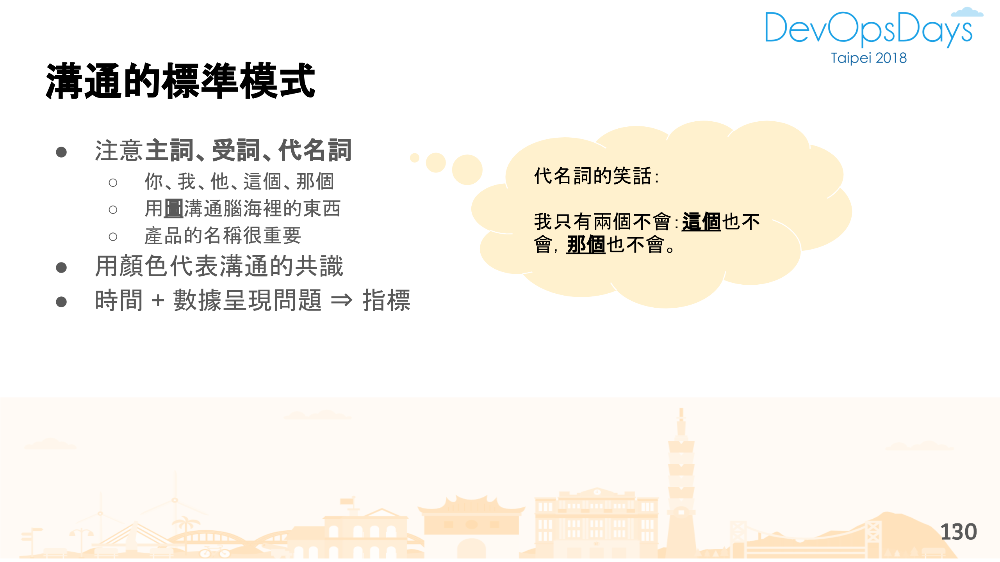
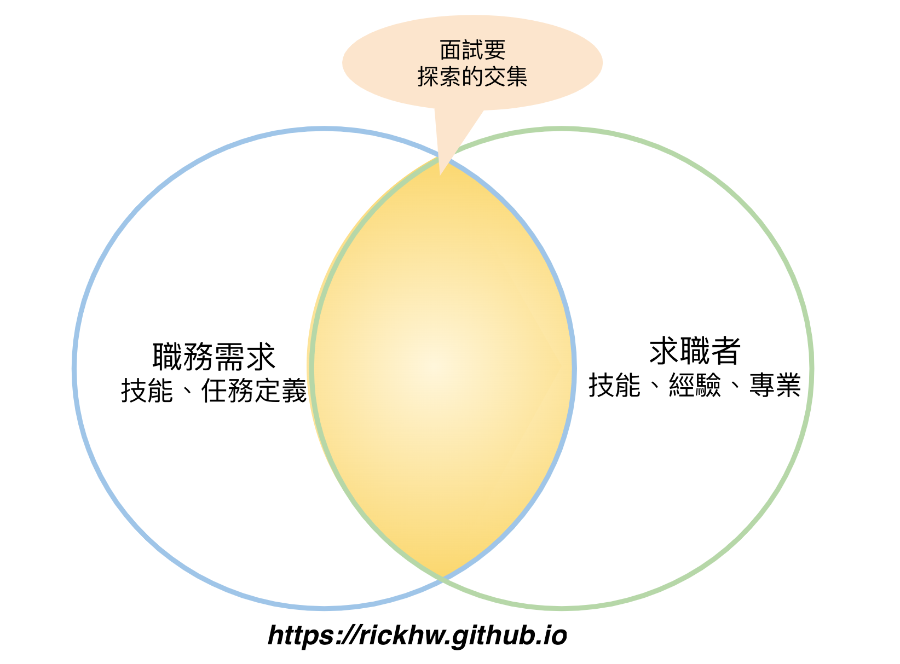
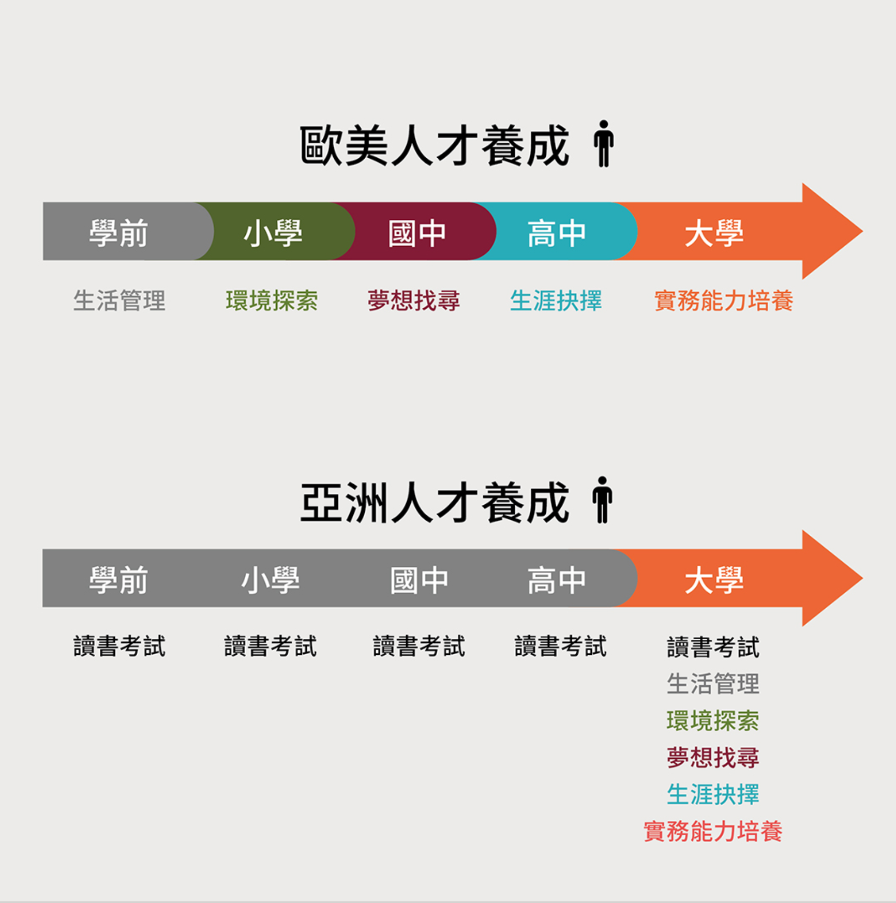

# 面試常見的問題

> 面試是雙向的，資方要用人，勞方要找機會，雙方透過面試找到彼此的交集、找到共事的可能與機會。本文整理數百次面試經驗過程中，常見的面試問題，希望可以協助更多求職者順利找到理想工作。
問題分成以下幾類：

一、履歷的問題
二、自我介紹的問題
三、面試過程的問題

這些問題種類，裡面各有代表性的各別整理問題

* * *

面試是雙向的，資方要用人，勞方要找機會，雙方透過面試找到彼此的交集、找到共事的可能與機會。本文整理數百次面試經驗過程中，常見的面試問題，希望可以協助更多求職者順利找到理想工作。

問題分成以下幾類：

*   一、履歷的問題
*   二、自我介紹的問題
*   三、面試過程的問題

這些問題種類，裡面各有代表性的各別整理問題的現象。

最後整理一些建議做法，給求職者參考。

* * *

面試從履歷就開始了。一份履歷大概都有以下東西：

*   個人基本背景：現代個資意識抬頭，不要需要揭露太多
*   技能：會哪一些技術、專業技能
*   經驗：在哪個公司擔任怎樣的角色、執行哪些任務，簡單說：做過哪一些事
*   自傳：自我介紹
*   其他相關資訊：作品、Blog、Github、證照、推薦 …

招募系列文章中：「[一、萬事起頭難：面試名單從哪來？](人力招募-一、萬事起頭難：面試名單從哪來？.md)」 就提到了，需要用人時，最痛苦、無力的就是撈單，這關是很多第一次用人的 Leader、主管要面對的題目，所以適度的篩選履歷是必要的。當每天要透過人力銀行看幾百份履歷，而當你的履歷沒有重點時，很容易就會被忽略掉。

履歷通常有以下幾種問題：

1.  包山包海
2.  Github、Blog 的問題
3.  其他履歷的問題

問題：包山包海
-----------------------------

履歷上都要告訴用人主管，我會什麼。

但 IT 的技術繁多，所以在技能描述上，寫了一堆東西，包山包海，什麼都有，曾經聽過的名詞上面都會出現，這種現象經常出現在資深的求職者身上；另外一個現象就是，技能的描述很少，幾乎什麼都沒有，通常出現在剛出社會的新鮮人。這兩個雖然都是極端的現象，但卻很常出現在履歷上。

人類的資訊接受是有層次的，當一堆訊息同時呈現的時候，會讓閱讀者抓不到重點。換言之，對於面試官來講，是否要發面試邀請函，必須是履歷上有符合的指標、或者關鍵字。

給求職者的建議：

*   列出最熟悉、最有心得的技術即可
*   整理技術的應用場景、實質貢獻
*   分享最自豪的、最挫折的、最想精進的、最想挑戰的

核心的想法是：

> 讓用人主管可以很容易知道，你擅長什麼？貢獻過什麼？受過怎樣的挫折？想往什麼方向走？

如果是積極的求職者，心裡已經有心儀的公司、嚮往的職位，最好是針對性地整理履歷，也就不同公司的、或者不同的職務，寫不同的履歷，然後主動投遞履歷。例如正在面的工作角色是 DevOps Engineer，那麼就可以針對過去在工作上，做了哪一些任務，這些任務用了怎樣的技術、解決怎樣的問題，透過這個過程，找到彼此的交集 (Intersection) 。

> DevOps Engineer 做什麼？參見 [需要專職的 Release Engineer？](https://rickhw.github.io/2018/12/16/DevOps/Hire-a-Release-Engineer/)

如果經驗真的很多，或者是想要讓面試官多了解自己，可以用 `從進到遠` 方式列舉，如下：

> 2017/03 ~ 2020/03 (3y)：
> 
> *   貢獻：
>     1.  ABC
>     2.  DEF
> *   技能：熟練度 (1-5)
>     1.  Java 5
>     2.  MySQL 4
> 
> 2013/03 ~ 2017/03 (4y)：
> 
> *   貢獻：
>     1.  ABC
>     2.  DEF
>     3.  GHI
> *   技能：熟練度 (1-5)
>     1.  ㄅㄆㄇ 3
>     2.  ㄍㄎㄏ 5

每個項目，建議列一兩項即可，詳細的可以放在自己的 Blog 或者 GitHub，而這些深淺可以透過實際案例表現給用人主管看，例如精通 Java 物件導向設計，直接導向自己的 Blog or GitHub，展現心得。

問題：GitHub 與 Blog
--------------------------------------------------------

延續上一個問題最後提到的 GitHub 與 Blog。

這幾年普遍面試軟體工程師，大部分的求職者都會附上 GitHub、Blog，甚至是 Slideshare。可能是整體份圍造就的風潮，被潮流驅動的行為，卻是讓機會變成雜訊，很多人履歷上付的 GitHub、Blog 並沒有辦法讓履歷加分。

有 GitHub 不等於:

*   程式寫得很好、對特定語言有掌握力
*   證明會什麼、能解決什麼問題

我常看到的現象就是：

*   太多不相關的 Fork Repos，自己寫的跟 fork 來的分不清楚
*   Repos 沒有 README.md，有也無法實際跑起來
*   程式碼沒有 Config 概念，或者有很多一看就是初學者的 Hardcode，像是把 database connection string 直接寫在 code 裡面，包含密碼
*   沒有 Artifact，換言之要怎麼跑起來使用者要自己想辦法
*   沒有文件說明如何設計、以及背後的想法

這些都是自曝其短，不過面試官也要花時間看才看得出來。所以只要太多 Fork 的，我就不看了。

另外是 Blog 的問題：

*   文章沒在更新：點進去看最新一篇是兩年前寫的
*   文章內容沒有結構、總結自己的觀點：通常就是一些安裝筆記，剪剪貼貼，但是沒有整體概念的總結，文章也沒有結構 (ToC)
*   生活跟工作混雜：求職目的還是希望能否有機會合作，所以 Blog 不要把這兩者混在一起，增加面試官瀏覽的難度

不管是 GitHub or Blog，感覺跟交作業沒兩樣。[學習法則](https://rickhw.github.io/2017/09/20/About/Learning-Approaches/) 一文整理了寫 Blog 的想法可參考看看。

問題：其他履歷的問題
--------------------------------------

除了上述，其他履歷的問題：

1.  無效的 link，像是無效的論文參考連結、無效的 blog 連結、無效的網站連結 (EC2 DNS)
2.  直接拒絕特定條件：例如月薪五萬以下不面、加班沒給加班費不面 … 直接拒絕的寫法很容易讓用人主管直接忽略，即使條件符合，不管戰功、技能有多優秀。
    *   真實案例：同一個人掛在人力銀行五年多，我都還看他在找工作
3.  自傳的問題：
    *   把祖宗十八代都交代過一輪了，就是沒有介紹自己
    *   資深工作者，只需要交代工作的心得、看法即可，遇到困難如何解決。

* * *

自我介紹就是讓面試官更了解應試者的過程，幾個常見的問題：

1.  沒有重點
2.  滔滔不絕

沒有重點
--------------------

自我介紹最常遇到的現象是太短、太簡單，不到兩分鐘就結束了，讓面試官抓不到重點。底下的自我介紹是我遇過實際的例子：

> 我負責全端，前端用 Vue.JS、後端用 Node.JS 和 MongoDB，也負責部署，碰一點點的 AWS，就這樣。

這面這段話，用手寫，可能只需要兩分鐘，用說的大概也只要十秒。我本來以為要開始講內容了，結果就沒了，還好我平常有練過，隨時都可以接話 XDD。

以往的台灣工程師有個刻板映像：沈默寡言、剛毅木訥、不喜交際、不善溝通、拙於言辭 … 等。但是面試這樣子的表達，會讓面試這件事情失去意義，也會讓面試官覺得不好了解彼此，造成不好的映像。

這樣的現象，要用 **SART 原則** [\[1\]](人力招募-一、萬事起頭難：面試名單從哪來？.md)，針對講述的內容，搭配履歷上寫的東西，引導應試者，重新自我介紹。我的標準問法如下，先針對任務引導：

1.  讓對方回到當時的時空背景：我通常問的是最近的映像最深刻的工作經驗，或者讓應試者選擇最有利的經驗
2.  背景資訊：有多少資源、任務的執行時間長度、與哪些人合作、開發過程是怎麼進行的、最後產出結果？
3.  遇到的問題：過程中曾遇過什麼問題？或者解決什麼難題？
4.  最後結果是什麼？自己覺得如何？

問法如下：

> 你履歷上寫負責這個新產品，是從無到有嗎？大概花多久時間？中間遇過什麼映像深刻的問題？

這時候大部分的應試者就會重新回到自我介紹上的東西，也就是介紹他在過去工作做的事，就不會像一開始那樣不知道說什麼。然後再針對講述的內容，追問：

1.  負責的角色，合作的團隊
2.  使用的技術，遇到哪一些問題、做得不錯的、不好的
3.  如何克服問題
4.  如果從來會怎麼做？

… 等更深入的討論。

應試者其實可以主動在自我介紹過程，透過這樣的方法，讓面試官更了解自己，避免讓面試官覺得，你只是被動來找工作的，而不是主動找機會、找舞台的。主動讓自己更有機會，讓面試官映像會更好。

而，應試者要做自我介紹，相對的，應試者可以要求面試官，做對等的回應，例如介紹公司、介紹團隊、介紹產品，介紹工作角色的定位 … 等。

我如果遇到幾句話就介紹完、或者五分鐘就聊不下去的，有時候我會這樣問：

> 思考一下，面試的目的是作什麼的？了解彼此，尋求合作的機會。

通常面試者就會很知道怎麼推銷自己。

滔滔不絕
--------------------

跟上一段是個極端現象，通常發生在工作一段時間的資深求職者，背景有豐富的實戰經驗、有精深的技術。

因為有很多經驗，所以迫不及待想分享心得、想法，過程大概就會有以下現象：

1.  完全忽略面試官的反應
2.  分享自己的鴻圖大略、懷才不遇
3.  開始賣起前東家的產品

遇過一些案例是開始在白板開始畫架構圖、或者 Demo 自己的作品，完全陶醉在自己設計東西，講的口沫橫飛，非常精彩，但卻忽略了一些點：

1.  沒有說明專有名詞：開頭就用產品的縮寫、或者前公司的術語介紹，導致面試官完全聽不懂在說啥
2.  沒有注意面試官的反應，尋求 Feedback，這是最常遇到的，有溝沒有通
3.  沈醉在自己的故事裡，跳不出來
4.  老闆不懂我的想法

溝通是雙向的，所以展現自己的作品時，一定要注意聽眾的反應，不管是面試、還是演講。

遇到這種狀況，跟上一段一樣，我還是會提醒對方：

> 面試的目的是作什麼的？

這時候就會回到面試的重點。

我曾經遇故一些狀況，表達得不錯，背景資訊清楚、名詞交代得很清楚、時間序列也有，但是：

> 他從頭到尾沒有停下來讓面試官講話

沒有觀察面試官的理解狀況，批哩啪拉講一堆。曾經遇過幾個案例是，面試時間一個小時，求職者進來就開始講，一個人講了 40 分鐘。還記得當時我跟一起面談的同事愣那裡，完全沒有插嘴的機會。

如果你是工作經驗豐富的求職者，最好是針對職務、公司設計自我介紹，講對自己有利的條件為主，避免陷入把自己生平的經歷，都在短短的幾個小時的面試，丟給面試官消化，這其實不切實際。

* * *

沒有適當的表達
-----------------------------

通常面試過程，都會請面試者分享技術上的經驗，例如分享產品架構、業務需求、怎麼設計 … 等。如果現場有白板，我就會直接請求職者在白板上畫圖。這過程常常有以下兩個問題：

1.  沒有適當的表達
2.  沒有有效的溝通

第一個問題是表達的問題。每家公司都有自己獨到的產品，產品都會有自己的名稱，以及內部的用詞與縮寫。很常遇到介紹過程直接用上一個工作的用詞與縮寫，沒有說明該縮寫是什麼意思，面試官往往是聽得一頭霧水。面試者沒有意會到名詞的有效範圍（這跟寫程式是一樣的），很容易讓後面的面談牛頭不對馬嘴。

> 1.  [溝通的原理](https://rickhw.github.io/2020/03/24/Management/Principles-of-Communication/) 是要讓大家更知道溝通背後的基本原理，了解原理才能有效表達
> 2.  我常會請同仁練習在白版畫架構圖，對內、對外都用同樣方法。其中很常做的就是把架構圖抽象化，抽象化之後可以讓其他同樣是技術背景的人，但是不同公司的人了解大概的狀況，這概念寫在 [系統發生異常時，第一時間如何快速止血？](https://rickhw.github.io/2019/10/04/DevOps/How-to-Figure-out-the-RootCause-for-an-AbnormalSystem-In-ZeroTime/) 最後面 `了解架構現況` 的方法。

表達最常出現的問題就是：

1.  沒有交代背景：名詞定義不清楚，太多代名詞
2.  對於結構交代不清楚：通常是在講架構的時候
3.  沒有時間序列：經常是在討論業務場景、問題背景

表達的不好，衍伸的問題就是無效的溝通。下圖是 2018 年 DevOpsDays [演講：從緊急事件 談 SRE 應變能力的培養](https://rickhw.github.io/2018/09/12/DevOps/DevOpsDaysTaipei2018-Emergency-And-Incident-Management/) 的整理：

表達的清楚，就會達到有效溝通，面試官、或者面試團隊聽得懂，那麼大家就會進入討論狀態。這時候某種程度，已經把你當做團隊的一份子了，換言之，已經是臨門一腳了。

沒有提問題
-----------------------

這是整體教育的問題，教育教我們解題，但很少人教我們思考：

> 這些問題從哪裡來的？

所以提問題經常是現場空白一片，勉勉強強的問一些不是很重要的，像是：

*   中午幾點休息
*   早上幾點前要到
*   有沒有年假
*   有沒有零食
*   主管最近什麼時候出國

上面這些問題，沒什麼營養，也沒什麼意義。特別是最後一個，是一般教戰守則的問題，這問題對我來講有點無腦。

> 我不把 `出國` 當作休息的方式，應該問我：你幾天沒彈吉他了？

工作是接下來一起相處長達 8 個小時以上的時間，準備問題是必要的，建議至少從以下角度切入問：

*   績效：了解自己在這裡有沒有未來性
    1.  如何進行績效評核？多久一次？
    2.  績效獎勵制度？升遷制度？
*   協作：了解日後工作的模式
    1.  團隊如何溝通協作？跨部門如何溝通？
    2.  衝突的解決方式？
    3.  目前職缺上的協作對象有哪些？
    4.  組織缺乏些什麼？
*   專業、任務：短中長期要面對的挑戰
    1.  目前職缺上的首要任務是什麼？
    2.  技術上急需改善的？
    3.  職務的長期路線？
    4.  緊急事件、系統故障的處理流程？
    5.  團隊如何面對對於新技術？如何導入？有成功案例？
*   公司未來：這家公司能否長期發展
    1.  公司的產品方向與目標業務為何？
    2.  員工能否知道營收狀況？
    3.  員工能否轉調？

* * *

感謝函
-----------------

如果是工作經驗不多的新鮮人，不仿寫一封感謝函給面試官，請面試官推薦你一些東西書，或者反問面試官對於今天自己的表現，給予建議。

你也可以請面試官提供一些推薦的書，表現出自己的謙遜、同時抬轎面試官。不同的面試官可能會給予不同的建議，像是有維運經驗的就會推薦 [SRE](https://rickhw.github.io/2018/08/03/DevOps/An-Introduction-to-SRE/)、持續交付、[Chaos Engineering](https://rickhw.github.io/2018/10/08/DevOps/Chaos-Engineering/) 等比較硬的，對於系統設計很有經驗的主管，大概就會以 Code Complete、Design Parrerns、Clean Code，重視基本功的就會要你回去把作業系統、資料結構、演算法、計算機網路、計算機結構 … 等基礎科學念好。

用心的面試官，會對你有映像，甚至會推薦你去其他部門、他同學的公司面試。

面試只是一種方式
--------------------------------

面試只是一種方式，實際上用人的手段很多。在人際網路建立連結，透過私下的場合，不管是社群、聚會、非正式場合，都是面試。很多高階屬性的工作機會，都不是透過正式的面試。但是本質沒有變：

> 找到彼此的交集，尋求合作的可能

概念如下圖：

有時候我會因為在一些場合，認識不同的朋友，對我來講，他們也可能在面試我，而我也在蒐集自己的口袋名單。

心得
--------------

我很常面試到職場新鮮人，很多新鮮人沒有人教、或者環境不好，很單純，很常會聊不下去。但不管怎樣，最後都會送給他們這些東西：

> 生涯規劃、財務管理、時間管理、英文很重要、[學習法則](https://rickhw.github.io/2017/09/20/About/Learning-Approaches/)、找自己

或許是一種社會責任，總覺得面試短短的時候，可以引導就試著引導。

除了面試，我也常常會回去看看現在團隊成員當時面試進來的履歷，看看他進來到現在，到底有多少成長。如果一年後的他／她，跟當初面試進來 CV 上看起來沒啥改變，那該好好檢討自己了。

最後 [引用](https://www.facebook.com/darencademy/posts/1291555721039795) 這張圖，圖中的現象雖然不見得完全正確，但這些現象的確是我很常遇到的：

1.  以為職場跟在學校一樣
2.  [不知道真實世界是什麼？](https://rickhw.github.io/2018/06/19/Management/Face-the-Real-World/)
3.  敢要求，卻不知道要付出
4.  太過理想化
5.  沒有自己的想法

* * *

系列文章
--------------------

*   [聊聊人力招募](聊聊人力招募.md)
*   [零、準備篇：確認需求、條件、定位、市場狀況](人力招募-零、準備篇：確認需求、條件、定位、市場狀況.md)
*   [一、萬事起頭難：面試名單從哪來？](人力招募-一、萬事起頭難：面試名單從哪來？.md)：撈單、詢問意願、電訪
*   [二、見面談：招募第一關-面試](人力招募-二、見面談：招募第一關-面試.md)：面試流程、評核
*   [三、深度對話：價值觀](人力招募-三、深度對話：價值觀.md)：為什麼二面？
*   [四、客觀談論：薪資](人力招募-四、客觀談論：薪資.md)：談薪資的考量點
*   [五、最後確認：報到時程](人力招募-五、最後確認：報到時程.md)
*   [六、到職後：訓練、目標、評核](人力招募-六、到職：訓練、目標、評核.md)
*   [面試常見的問題](面試常見的問題.md)
*   [管理必經之路：遣散、解僱、辭呈](管理必經之路：資遣、解僱、辭呈.md)

* * *

* * *

[Source](https://rickhw.github.io/2020/06/21/Management/Interview-Problems/)